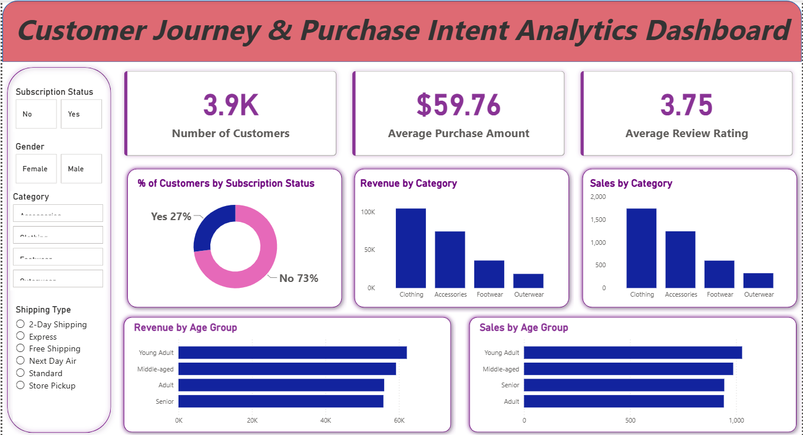

# 🛍️ Customer Behavior & Purchase Intent Analysis

## 📌 Project Overview
A retail company wanted to understand its customers' shopping behavior to 
improve sales, engagement, and long-term loyalty. This project analyzes 
3,900 customer transactions to uncover which factors — discounts, reviews, 
shipping type, and subscriptions — drive purchase decisions and repeat 
buying, and translates the findings into actionable business recommendations.

## 🛠️ Tools & Technologies
- **Python (Pandas)** – Data cleaning, missing value handling, feature engineering
- **MySQL** – Business analysis using SQL queries
- **Power BI** – Interactive dashboard for visualization

## 🔍 What I Did
- Cleaned and prepared raw data (handled missing values, standardized columns, engineered new features like age groups)
- Loaded the cleaned dataset into PostgreSQL for structured analysis
- Wrote SQL queries to answer key business questions on customer segments, discount impact, and revenue drivers
- Built an interactive Power BI dashboard with KPIs, filters, and category/age-group breakdowns

## 📊 Dashboard Preview

## 💡 Key Findings
- Male customers generated significantly higher total revenue than female customers
- Only 27% of customers are subscribed — a major growth opportunity
- Express shipping customers spend slightly more on average than Standard shipping customers
- A small set of products (Hat, Sneakers, Coat) rely heavily on discounts to drive sales
- Majority of customers fall into the "Loyal" segment based on purchase history

## ✅ Business Recommendations
- Promote subscription benefits to convert more non-subscribers
- Launch loyalty rewards to retain and grow the "Returning" customer segment
- Review discount dependency on top products to protect margins
- Focus marketing on high-revenue age groups and express-shipping users

## 📚 Dataset Source
Public dataset used for learning purposes.
  
## 📁 Files in this Repository
| File | Description |
|------|-------------|
| `analysis.ipynb` | Python notebook — data cleaning & EDA |
| `sql_queries.sql` | SQL queries for business analysis |
| `customer_shopping_behavior.csv` | Raw dataset |
| `dashboard.pbix` | Power BI dashboard file |

## 👤 Author
Amit Sigh  
[LinkedIn](linkedin.com/in/amit-singh-da) | [GitHub]([your-github-url](https://github.com/amitsingh-uit/Customer-Journey-Purchase-Intent-Analytics-Dashboard/edit/main/README.md))
